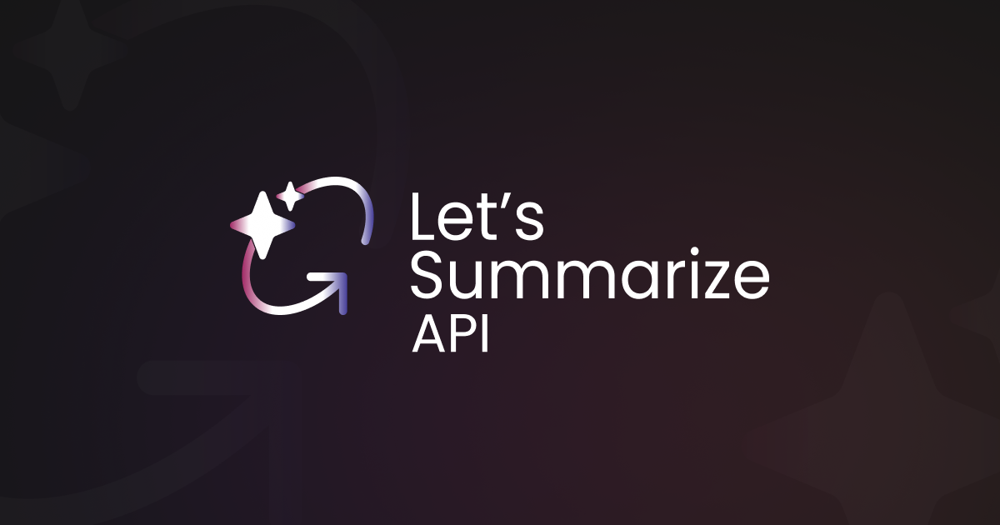

<h1>Let's Summarize API</h1>

Let's Summarize API is a backend service that provides video, document, and raw text summarization capabilities. Users can integrate this service into their applications, offering summarization for videos via YouTube URLs, document files, and raw texts.

---

## API Documentation

The API documentation provides guides on integrating and using **Let's Summarize API**.

- [Introduction](./docs/introduction.md)
- [Getting Started](./docs/getting-started.md)
- [Authentication](./docs/authentication.md.md)
- [API Endpoints](./docs/api-endpoints.md)
- [Summarization Options & Customization](./docs/summarization-options-customization.md)
- [Error handling & Debugging](./docs/error-handling-debugging.md)
- [File Storage](./docs/file-storage.md)

## Let's Summarize Web Application

Explore the **Let's Summarize** web application to experience the API in action:

[Let's Summarize Web App](https://github.com/letssummarize/web-app)
